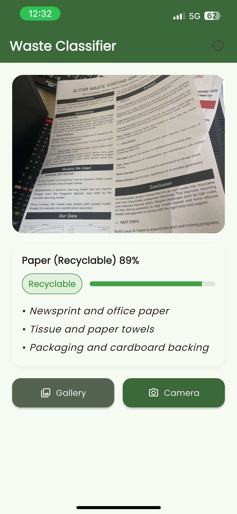
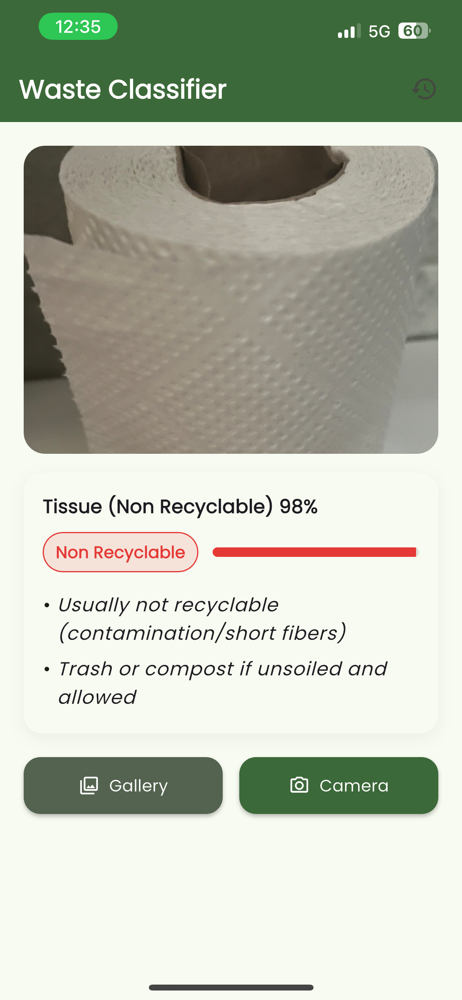
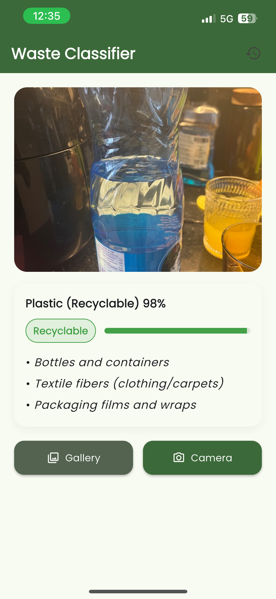
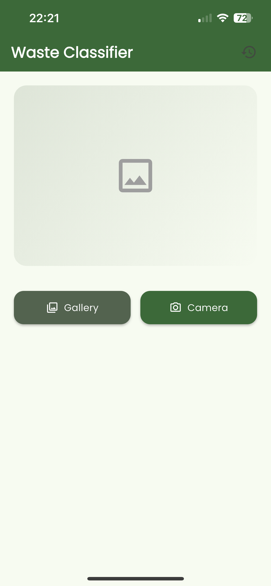
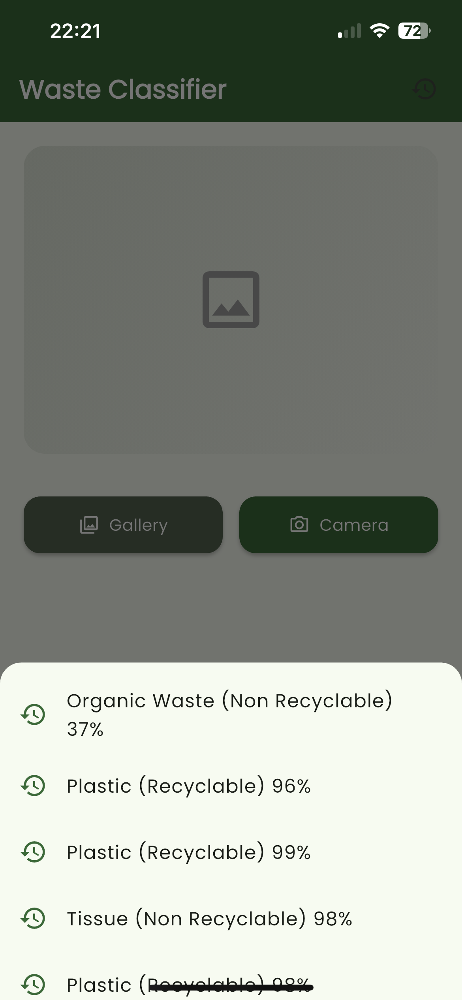

# Waste Classifier

A mobile Flutter application that classifies waste items as **Recyclable**, **Non-Recyclable**, or **Conditionally Recyclable**, using a custom-trained **TensorFlow Lite model**. It also provides guidance on how each material can be handled after classification.

---

## Features

- Take photos using camera or choose from gallery.
- Offline ML classification with a `.tflite` model.
- Categorizes into:
  - Recyclable
  - Non Recyclable
  - Check Condition
- Shows confidence percentage and visual progress bar.
- Displays recycling tips and reuse possibilities per material.
- Stores local classification history.
- Beautiful UI with Material 3, Poppins fonts, and subtle animations.

---

## Screenshots

### Classification Flow
| Classification Screen | Results Card | Gallery & Camera Selection |
|-----------------------|--------------|-----------------------------|
|  |  |  |

### App Pages
| Homepage | Recents |
|----------|---------|
|  |  |

---

## Model

- Trained using TensorFlow and converted to `.tflite`.
- Supports multi-class image classification.
- Labels stored in `assets/labels.txt`.

---

## Folder Structure

```bash
assets/
 ├── icon.png                   # App icon (1024x1024)
 ├── labels.txt                 # Class labels (one per line)
 ├── recycle_classifier.tflite  # TFLite model file
 ├── recycle_classifier_fixed.tflite
 ├── recycle_classifier_new.tflite
 ├── example1.PNG                # Classification screen
 ├── example2.PNG                # Result card
 ├── example3.PNG                # Gallery/Camera selection
 ├── homepage.PNG                # Homepage screen
 └── recents.PNG                 # Recents/history screen
